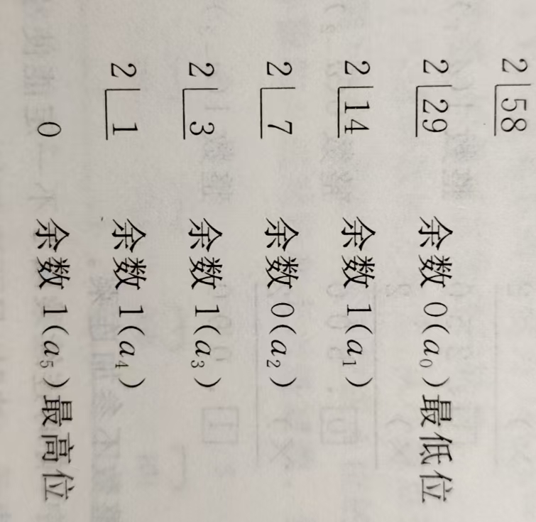
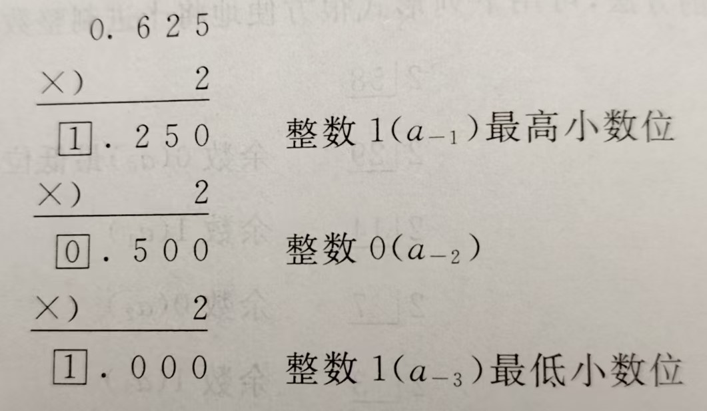
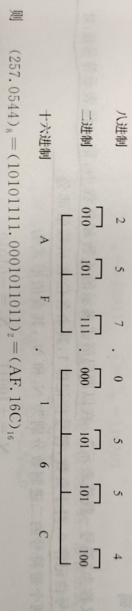
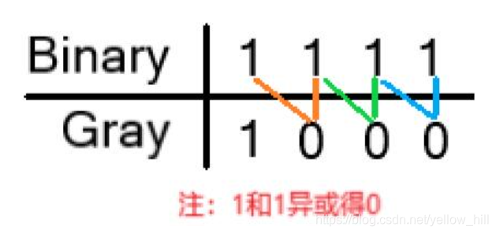
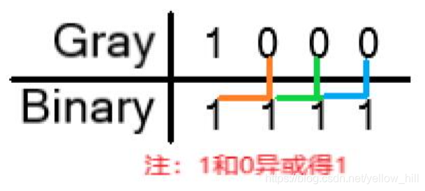
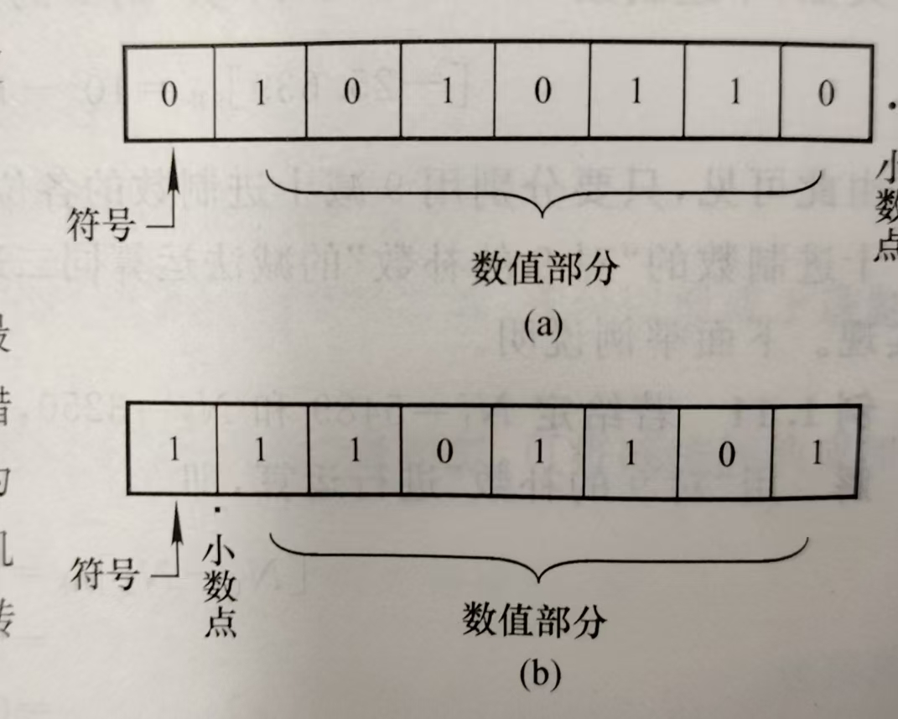
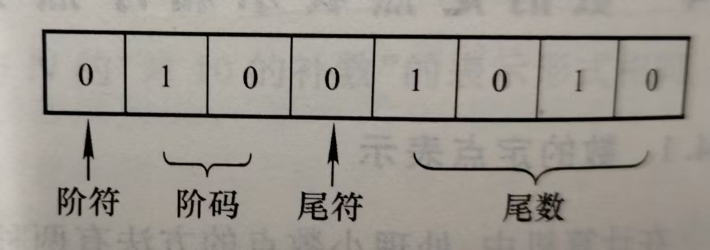
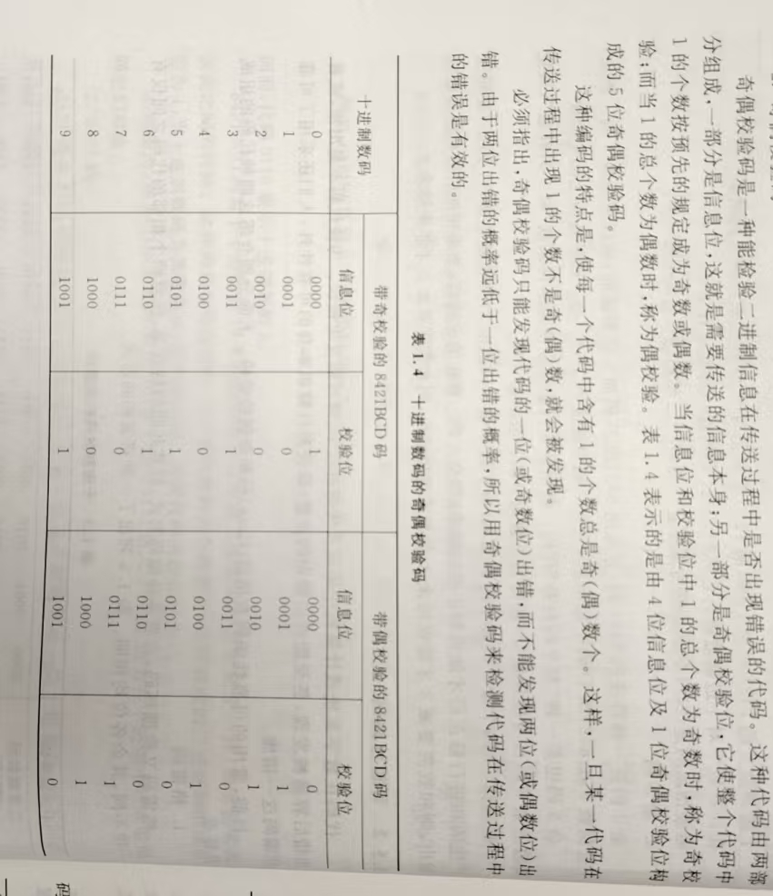

# 数制与编码

## 需要掌握知识点

- 各进制按权展开和位置展开表示法
- 二进制运算法则
- 各进制的转换（整数，小数，带小数的整数，精确到第几位）
- 二进制原码，反码，补码的书写和转换以及运算
- 十进制原码，补码，反码的书写和运算
- 8421BCD码以及2421编码与二进制之间的转化
- 余三码和8421BCD编码的转化
- 格雷码与二进制码的转化

## 总结

- 位置展开表示法 = 按权展开表示法

  - $(632.45)_{10} = (6 * 10^{2}+3*10^1+2*10^0+4*10^{-1}+5*10^{-2})_{10}$
    $(1001)_2 = (1 * 2^3+0*2^2+0*2^1+1*2^0)_2$

- 二进制运算法则
  $$
  \begin{align}
  &0+0=0\qquad0+1=1\\&1+0=1\qquad1+1=1\;(\text{同时向相邻高位进1}) \\
  &0-0=0\qquad0-1=1\;(\text{同时向相邻高位借1})\\&1-0=1\qquad1-1=0 \\
  &0*0=0\qquad0*1=0\\&1*0=0\qquad1*1=1 \\
  &0/1=0\qquad1/1=1 \\
  \end{align}
  $$

- 进制转换

  小数位和整数位分开计算，然后组合在一起即可

  

    
    
  

  

    
  

- 二进制原码、反码和补码转换

  |  类型  | 正纯整数 | 负纯整数 | 正纯小数 | 负纯小数 |
  | :----: | :------: | :------: | :------: | :------: |
  | 符号数 |   +31    |   -31    | +0.3125  | -0.3125  |
  |  真值  |  +11111  |  -11111  |  0.0101  | -0.0101  |
  |  原码  |  011111  |  111111  |  0.0101  |  1.0101  |
  |  反码  |  011111  |  100000  |  0.1010  |  1.1010  |
  |  补码  |  011111  |  100001  |  0.1011  |  1.1011  |

  **原码：**在二进制中，第一位表示符号位，正为0，负数为1，其余各位表示数值部分

  **反码：**在二进制中，第一位表示符号位，正为0，负数为1。对于正数，反码与补码相同；对于负数，反码的数值是将原码数值按位求反，符号位最后加

  **补码：**在二进制中，第一位表示符号位，正为0，负数为1。对于正数，反码与补码相同；对于负数，补码是将原码取反再在最低位加1，符号位最后加

- 二进制原码、反码和补码的运算

  - 原码：符号不参与计算，符号相同则数值绝对值相加，符号保持不变。

  - 反码：
    $$
    [N_1+N_2]_反=[N_1]_反+[N_2]_反 \\
    [N_1-N_2]_反=[N_1]_反+[-N_2]_反 \\
    $$
    符号位需要参与运算。如果符号位产生进位，则需要将此进位置于第一位再次进行计算，称为**“循环进位”**。最后符号位为0，则是正数反码，与原码相同；为1，则为负数反码，需要再次取反码才能获得原码。

  - 补码：
    $$
    [N_1+N_2]_补=[N_1]_补+[N_2]_补 \\
    [N_1-N_2]_补=[N_1]_补+[-N_2]_补 \\
    $$
    符号位需要参与运算。如果符号位产生进位，则需要将此**进位丢掉**。最后符号位为0，则是正数补码；为1，则为负数补码。

- 十进制原码，补码，反码的书写以及运算

  - 对“10”的补数

    对于**正数，它本身**（整数前面加0）

    对于负数，只需要用**10减去最低非0的数，然后用9减去所有较高位的数，然后添加符号位**（0表示正，9表示负），就可以形成十进制数对“10”的补数（补码）

  $$
  &[-3250]_{10补}=10^5-3250=96750 \\
  &[-0.3267]_{10补}=10-0.3267=9.6733 \\
  &[3250]_{10补}=03250 \\
  &[0.3267]_{10补}=0.3267 \\
  $$

  - 对“9”的补数

    对于**正数，它本身**（整数前面加0）

    对于负数，只需要**用9减去所有位的数，然后添加符号位**（0表示正，9表示负），就可以形成十进制数对“9”的补数（反码）
    $$
    &[-3250]_{9补}=10^5-1-3250=96749 \\
    &[-25.639]_{9补}=10^3-10^{-3}-25.639=974.360 \\
    &[3250]_{9补}=03250 \\
    &[0.3267]_{9补}=0.3267 \\
    $$

  - 运算与二进制相似

- 8421BCD码与二进制之间的转化（2421编码同理）

  需要将每一位十进制/每四位二进制拆出来单独编码

$$
&(N)_{10}=8*a_3+4*a_2+2*a_1+1*a_0=(a_3a_2a_1a_0)_{8421BCD} \\
&(0110\;1000\;0011)_{8421BCD}=(683)_{10}=(1010101011)_2 \\
&(0100\;0101.1001)_{8421BCD}=(45.9)_{10}=(101101.1001)_2 \\
$$

- 余三码和8421BCD编码的转化

  余三码由8421BCD编码加三得到
  $$
  [(0100)_{8421BCD}]_{余3}=(0100 + 0011)_{余3}=(0111)_{余3}
  $$

- 格雷码与二进制码的转化

​	格雷码从0开始，第一步，改变最右边的位元值；

​	第二步，改变右起第一个为1的位元的左边位元；

​	第三步，第四步重复第一步和第二步，直到所有的格雷码产生完毕

  
  

​	**二进制转格雷码**原理：如果二进制码字的第 i 位和 i+1 位（从右边开始数）相同，则对应的格雷码的第i位为0，否则为1（当i+1=n时，二进制码字的第n位被认为是0，即第n-1位不变）

​	**格雷码转二进制**原理：从左边第二位起，将每位与左边一位解码后的值进行异或，作为该位解码后的值（最左边一位依然不变），直到最低位

  
  

## 进位计数值

### 十进制数的表示

#### 基础概念

- **数码：**可以用来表示每位数的数字，eg：十进制数的数码有0，1...9十个数码

- **基数：**表示进位计数值具有的数字的个数，eg：十进制基数为10，八进制为8

- 在$632.45 = 6 * 10^{2}+3*10^1+2*10^0+4*10^{-1}+5*10^{-2}$中，等号左边的十进制表示方法称为**位置计数展开法**，等式右边的部分称为**按权展开表示法**

  - 一般转换法：
    $$
    \begin{align}
    (N_r)&=(a_{n-1}a_{n-2}...a_{1}a_{0}.a_{-1}a{-2}...a_{-m})_r\\
    &=a_{n-1}*r^{n-1}+a_{n-2}*r^{n-2}+...+a_1*r^1+a_0*r^0+a_{-1}*r^{-1}+a_{-2}*r^{-2}+...+a_{-m}*r^{-m}\\
    &=\sum_{i=-m}^{n-1}a_ir^i
    \end{align}
    $$
    表示对于任意的数N，都能表示成以r为基数的r进制数

- PS：

  - 对十进制数的表示，可以在数字的右下角标注10或D
  - 对二进制数的表示，可以在数字的右下角标注2或B
  - 对八进制数的表示，可以在数字的右下角标注8或O
  - 对十六进制数的表示，可以在数字的右下角标注16或H

### 二进制数制的表示

$$
(1001)_2 = (1 * 2^3+0*2^2+0*2^1+1*2^0)_2
$$

#### 运算法则

- 加法规则：
  $$
  \begin{align}
  &0+0=0\qquad0+1=1\\&1+0=1\qquad1+1=1\;(\text{同时向相邻高位进1})
  \end{align}
  $$

- 减法规则：
  $$
  \begin{align}
  &0-0=0\qquad0-1=1\;(\text{同时向相邻高位借1})\\&1-0=1\qquad1-1=0
  \end{align}
  $$

- 乘法规则：
  $$
  \begin{align}
  &0*0=0\qquad0*1=0\\&1*0=0\qquad1*1=1
  \end{align}
  $$

- 除法规则：
  $$
  \begin{align}
  0/1=0\qquad1/1=1
  \end{align}
  $$

#### 特点

- 二进制数只有0&1两个数码，任何具有两个不稳定状态的元器件都可以用来表示一位二进制数。
- 运算规则简单。
- 二进制数只有两个状态，数字的传输和处理不容易出错，可靠性高。
- 二进制数的01可以与逻辑代数的逻辑变量真假对应，这样在逻辑运算中就可以使用逻辑代数。

## 数制转换

### 十进制与二进制的转换

#### 十进制->二进制

1. 先将十进制数写成$(N)_{10}=<整数部分>_{10}.<小数部分>_{10}$
2. 再将整数和小数部分分别转换为二进制
3. 最后组合回$(N)_{2}=<整数部分>_{2}.<小数部分>_{2}$

##### 整数转化

**采用除以2取余数：**

​	原理：
$$
\begin{align}
(58)_{10}&\equiv(a_{n-1}a_{n-2}...a_{1}a_{0})_2\\
&=a_{n-1}*2^{n-1}+a_{n-2}*2^{n-2}+...+a_1*2^1+a_0*2^0\\
&=2(a_{n-1}*2^{n-2}+a_{n-2}*2^{n-3}+...+a_1*2^0)+a_0
\end{align}
$$
​	此时左右同除以2：
$$
\begin{align}
(29)_{10}\equiv(a_{n-1}*2^{n-2}+a_{n-2}*2^{n-3}+...+a_1*2^0)+\frac{a_0}{2}
\end{align}
$$
​	整数部分和小数部分必须对应相等，由于左侧余数为0，故右侧$a_0=0$

​	等式左右两侧再次同除以2：
$$
(14+\frac{1}{2})\equiv(a_{n-1}*2^{n-2}+a_{n-3}*2^{n-4}+...+a_2*2^0)+\frac{a_1}{2}
$$
​	此时左侧余数为1，则右侧$a_1=1$

​	需要注意的是，每当完成一次运算后，需要将余数部分拿去再进行运算。

针对上述规则，我们可以简化过程为竖式运算：

  

​	因此$(58)_{10}=(111010)_2$

##### 纯小数转化

**采用乘2取整：**

原理：
$$
\begin{align}
(0.625)_{10}&\equiv(0.a_{-1}a_{-2}...a_{-m})_2\\
&=a_{-1}*2^{-1}+a_{-2}*2^{-2}+...+a_{-m}*2^{-m}\\
&=a_{-1}*2^{-1}+\frac{1}{2}(a_{-2}*2^{-1}+...+a_{-m}*2^{-(m-1)})
\end{align}
$$
​	此时两边同乘2：
$$
(1.25)_{10}\equiv a_{-1}+(a_{-2}*2^{-1}+...+a_{-m}*2^{-(m-1)})
$$
​	两个数始终相等，其整数部分和小数部分一定分别相等，因此$1=a_{-1}$

​	等式左右侧再次同时乘2：
$$
\begin{align}
(0.5)_{10} & \equiv a_{-2}+\frac{1}{2}(a_{-3}*2^{-1}+...+a_{-m}*2^{-(m-2)})
\end{align}
$$
​	此时左右整数部分相等知$0=a_{-2}$

​	需要注意的是，每当完成一次运算后，需要争输赢部分拿去再进行运算。

针对上述规则，我们可以简化过程为竖式运算

  

​	因此$(0.625)_{10}=(0.101)_2$

**值得注意的是**十进制小数部分转化，连乘2不一定能够使得小数部分为0，有些小数不能够使用有限的二进制小数表示出来。只需要取得足够多的位数达到足够的精度即可。无需四舍五入。

### 八进制、十六进制与二进制数的转化

#### 二进制->八进制

原理：
$$
\begin{align}
(010101111)_{2}&=1*2^0+1*2^1+1*2^2+1*2^3+0*2^4+1*2^5+0*2^6+1*2^7+0*2^8\\
&=2^0*(1*2^0+1*2^1+1*2^2)+2^3*(1*2^0+0*2^1+1*2^2)+2^6*(0*2^0+1*2^1+0*2^2)\\
&=8^0*(1*2^0+1*2^1+1*2^2)+28^1*(1*2^0+0*2^1+1*2^2)+8^2*(0*2^0+1*2^1+0*2^2)\\
&=8^0*7+28^1*5+8^2*2\\
&=(257)_8
\end{align}
$$

#### 二进制->十六进制

原理：
$$
\begin{align}
(010101111)_{2}&=1*2^0+1*2^1+1*2^2+1*2^3+0*2^4+1*2^5+0*2^6+1*2^7+0*2^8\\
&=2^0*(1*2^0+1*2^1+1*2^2+1*2^3)+2^4*(0*2^0+1*2^1+0*2^2+1*2^3+0*2^4)\\
&=16^0*(1*2^0+1*2^1+1*2^2+1*2^3)+16^1*(0*2^0+1*2^1+0*2^2+1*2^3+0*2^4)\\
&=16^0*F+16^1*A\\
&=(AF)_{16}
\end{align}
$$
因为十六进制、八进制和二进制的基数之间有幂次关系，因此可以简化运算如下：

  

### 总结

  
  

  

## 带符号数的代码表示

### 真值与机器数

#### 基础概念

- **符号数：**不带符号的数字是符号数的绝对值，那么符号数就是由正负号和绝对值组成的数。eg：+256、-256
- **符号数的真值：**带正负号的二进制数
- **机器数：**将符号数字化的带符号二进制数。习惯上用0表示正号，用1表示负号。符号在最高位

#### 原码（符号-数值表示）

**原码形式表示：**在二进制中，第一位表示符号位，正为0，负数为1，其余各位表示数值部分

例子：

​	带符号二进制数$N_1$ 和$N_2$，其真值：$N_1=+10011\quad N_2=-10011$

​	那么原码：$[N_1]_原=010011 \quad [N_2]_原=110011$

对于一个n位的整数N（包括一位符号位）的原码以代数形式表示：
$$
[N]_原 = 
\begin{cases} 
  N, & \text{if } 0 \le x < 2^{n-1} \quad &\text{就是本身前面补一个0} \\
  2^{n-1} - N, & \text{if } -2^{n-1} < x \le 0 \quad &\text{就是10...00 - 负原码}\\
\end{cases}
$$
对于定点小数，小数通常在最高位的左边，这时候数值小于1，原码表示为：
$$
[N]_原 = 
\begin{cases} 
  N, & \text{if } 0 \le x < 1 \\
  1 - N, & \text{if } -1 < x \le 0 \\
\end{cases}
$$
总结：

- 当N为正数时，只是最高位加一个0，原码就是本身

- 当N为负数时，只是最高位加一个1

- 原码表示中0有两种状态：
  $$
  [+0]_原=0.00...0\\
  [-0]_原=1.00...0
  $$

#### 反码（对“1”的补数）

**反码形式表示：**在二进制中，第一位表示符号位，正为0，负数为1。对于正数，反码与补码相同；对于负数，反码的数值是将原码数值按位求反，符号位最后加

例子：

​	带符号二进制数$N_1$ 和$N_2$，其真值：$N_1=+10011\quad N_2=-10011$

​	那么原码：$[N_1]_反=010011 \quad [N_2]_反=101100$

对于一个n位的整数N（包括一位符号位）的原码以代数形式表示：
$$
[N]_反 = 
\begin{cases} 
  N, & \text{if } 0 \le x < 2^{n-1} \quad &\text{就是本身前面补一个0} \\
  (2^{n} - 1) + N, & \text{if } -2^{n-1} < x \le 0 \quad &\text{就是11...11 - 负原码}\\
\end{cases}
$$
对于定点小数，若小数部分的位数位m，原码表示为：
$$
[N]_反 = 
\begin{cases} 
  N, & \text{if } 0 \le x < 1 \\
  (2 - 2^{-m}) + N, & \text{if } -1 < x \le 0 \\
\end{cases}
$$
总结：

- 当N为正数时，只是最高位加一个0，原码以及反码就是本身

- 当N为负数时，只是最高位加一个1，其余位数是将原码数值按位取反

- 反码表示中0有两种状态：
  $$
  [+0]_反=0.00...0\\
  [-0]_反=1.11...1
  $$

#### 补码（对“2”的补码）

**原码形式表示：**在二进制中，第一位表示符号位，正为0，负数为1。对于正数，反码与补码相同；对于负数，补码是将原码取反再在最低位加1，符号位最后加

例子：

​	带符号二进制数$N_1$ 和$N_2$，其真值：$N_1=+10011\quad N_2=-10011$

​	那么补码：$[N_1]_补=010011 \quad [N_2]_补=101101$

对于一个n位的整数N（包括一位符号位）的原码以代数形式表示：
$$
[N]_补 = 
\begin{cases} 
  N, & \text{if } 0 \le x < 2^{n-1} \quad &\text{就是本身前面补一个0} \\
  2^{n} + N, & \text{if } -2^{n-1} < x \le 0 \quad &\text{就是10...00 - 负原码 + 1}\\
\end{cases}
$$
对于定点小数，小数通常在最高位的左边，这时候数值小于1，原码表示为：
$$
[N]_原 = 
\begin{cases} 
  N, & \text{if } 0 \le x < 1 \\
  2 + N, & \text{if } -1 < x \le 0 \\
\end{cases}
$$
总结：

- 当N为正数时，只是最高位加一个0，原码、反码和补码就是本身

- 当N为负数时，只是最高位加一个1，然后数值部分取反，最低位加1

- 补码表示中0只有一种唯一状态：
  $$
  [+0]_补=0.00...0\\
  [-0]_补=0.00...0
  $$

逻辑电路执行减法非常困难，所以开发三种码制，以简化逻辑电路的构造，加快执行速率

#### 总结

|  类型  | 正纯整数 | 负纯整数 | 正纯小数 | 负纯小数 |
| :----: | :------: | :------: | :------: | :------: |
| 符号数 |   +31    |   -31    | +0.3125  | -0.3125  |
|  真值  |  +11111  |  -11111  |  0.0101  | -0.0101  |
|  原码  |  011111  |  111111  |  0.0101  |  1.0101  |
|  反码  |  011111  |  100000  |  0.1010  |  1.1010  |
|  补码  |  011111  |  100001  |  0.1011  |  1.1011  |

### 机器数的加减运算

#### 原码运算

原码中的符号位仅仅用于表示数的正负，不参与计算。

- 比较符号

​			相同->两个数直接相加，符号不变

​			不同->比较两个数的大小，数值较大的数减去数值较小的数，符号与数值较大的数保持相同

#### 补码运算

**基础法则**
$$
[N_1+N_2]_补=[N_1]_补+[N_2]_补 \\
[N_1-N_2]_补=[N_1]_补+[-N_2]_补 \\
$$
补码中的符号位和数值位都需要参与运算。如果符号位产生进位，则需要将此进位丢掉。最后符号位为0，则是正数补码；为1，则为负数补码。

#### 反码运算

**基础法则**
$$
[N_1+N_2]_反=[N_1]_反+[N_2]_反 \\
[N_1-N_2]_反=[N_1]_反+[-N_2]_反 \\
$$
反码中的符号位和数值位都需要参与运算。如果符号位产生进位，则需要将此进位置于第一位再次进行计算，称为**“循环进位”**。最后符号位为0，则是正数反码，与原码相同；为1，则为负数反码，需要再次取反码才能获得原码。

### 十进制的补数

#### 十进制补码（对“10”的补数）

只需要用10减去最低非0的数，然后用9减去所有较高位的数，然后添加符号位（0表示正，9表示负），就可以形成十进制数对“10”的补数（补码）——

对于十进制的正数N，其补码为最高位加一个0表示符号即可。

对于十进制的负数N，$[N]_{10补}=10^n+N, \quad -10^{n-1}<N<0$

#### 十进制反码（对“9”的补数）

只需要用9减去所有位的数，然后添加符号位（0表示正，9表示负），就可以形成十进制数对“9”的补数（反码）——

对于十进制的正数N，其反码为最高位加一个0表示符号即可。

对于十进制的负数N，$[N]_{9补}=10^n-10^{-m}+N, \quad -10^{n-1}<N<0$

其中n是十进制负数N的整数部分（包括一位符号位）；m是十进制负数N的小数部分的位数。

**运算均与二进制相似**

## 数的定点表示和浮点表示

### 数的定点表示

在机器中小数点约定固定在某个位置，称为定点数。固定在最低位右边的数称为整数，固定在数的最左端（符号位右端）的称为分数或者小数。

带符号的定点数一般用于算数运算；不带符号的一般用于表示逻辑量或者某些特征值。

  

### 数的浮点表示

浮点数的一般表示形式：
$$
N=2^J*S
$$
其中S表示N的尾数，J表示数N的阶码，2为阶码的基数。

同时 S 需要满足 $\frac{1}{2} \le \left| S \right| < 1$

  

**特殊的**，当浮点数的尾数或者阶码为最小值的时候，通常把该数当作0，称为机器0

#### 优劣差别

位数相同情况下

- 浮点数表示范围比定点数大，并且精度也一般比定点数高
- 但是浮点数的运算相较定点数复杂，需要考虑阶码和位数两部分，因此实现电路会更为复杂。

## 数码和字符的代码表示

### 十进制数的二进制编码（二-十进制码/BCD码）

一般采用四位2进制数表示一位十进制数，因此产生多种编码格式。

#### 8421BCD码

将1 2 3 ... 9 依次二进制编码，且为有固定权码，分别为8 4 2 1。按权展开为：
$$
N=a_3W_3+a_2W_2+a_1W_1+a_0W_0
$$
例如：6的8421BCD码0110按权展开为：$0*8+1*4+1*2+0*1 = 6$

#### 2421码

也是一种有固定权码，只是权重与8421BCD码不同，为2 4 2 1

例如：1011按权展开为：$1*2+0*4+1*2+1*1 = 5$

2421码是一种“对9自补码”，0与9，1与8...对应的码位，一个为0，一个就为1，互为反码。

#### 余3码

余3码为特殊8421码，由8421BCD码加3形成。同时它也是“对9自补码”。

但是必须注意的是，余3码相加会余6，若没有进位则减3即可，若进位则要加3。

### 可靠性编码

为了使得数据在传播过程中不容易发生错误，需要采取可靠的编码。

#### 格雷码

相邻的两个数之间，只有一个位数不同。

  

#### 奇偶校验码

  

